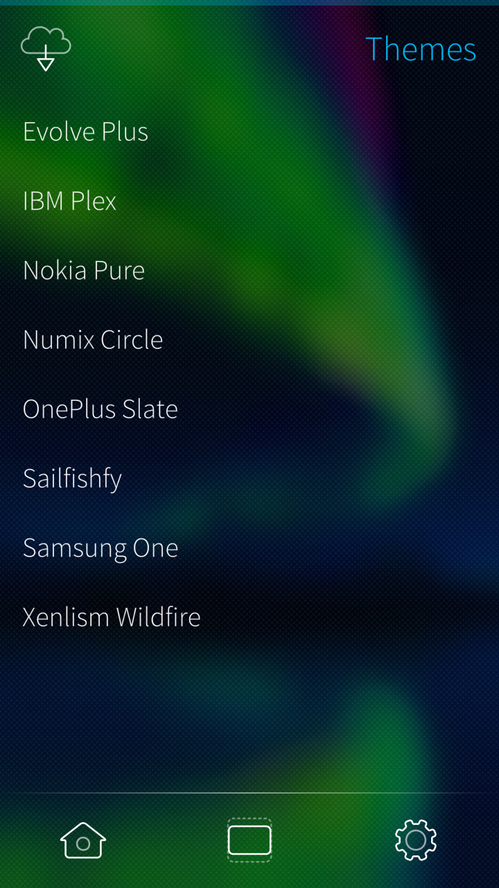
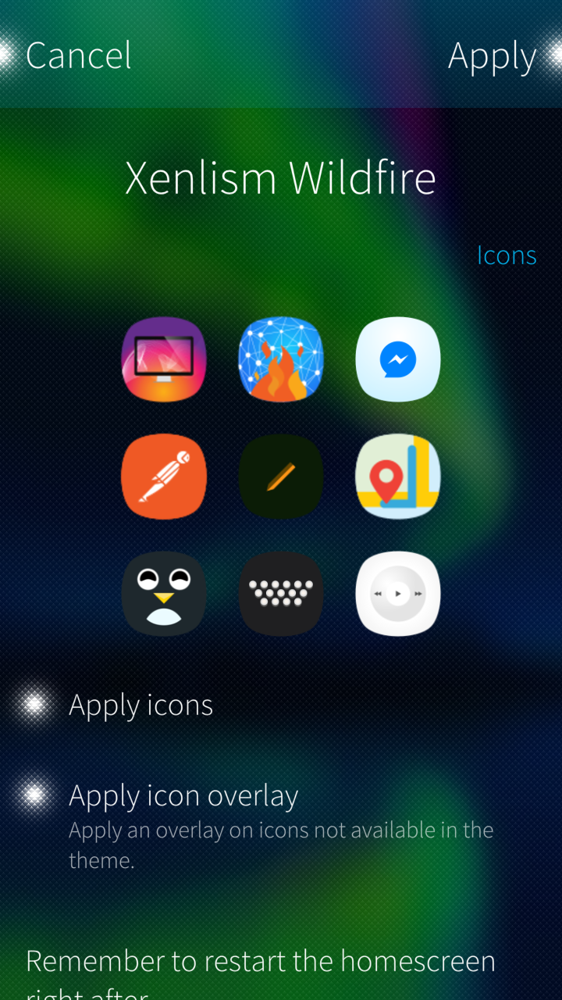
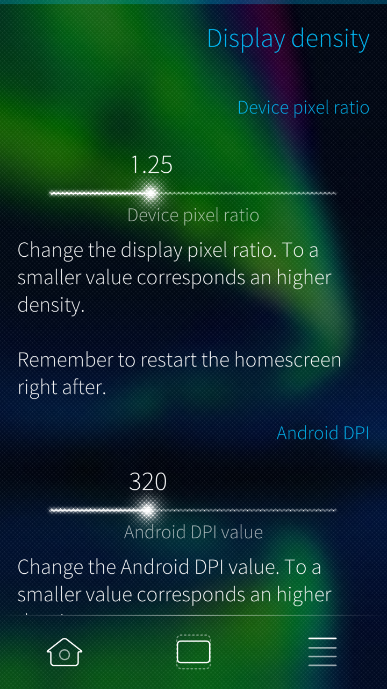

# UI Themer

Graphical User Interface for [Theme pack support](https://fravaccaro.github.io/themepacksupport-sailfishos/).

## Features

  
 

- Icon theming.
- Font theming.
- Change device pixel ratio.
- Change DPI for Alien Dalvik.

## Create custom theme packs

Documentation on how to create theme packs available [here](https://fravaccaro.github.io/themepacksupport-sailfishos/docs/getstarted.html).

## Translate

Request a new language or contribute to existing languages on the [Transifex project page](https://www.transifex.com/fravaccaro/ui-themer).

## Builds

Builds for armv7hl and i486 available on [OpenRepos](https://openrepos.net/content/fravaccaro/ui-themer).

## Roadmap

Roadmap and features will be tracked down on the [Trello dashboard](https://trello.com/b/WwLwj2eu/ui-themer).

## Credits

- Partially based on [Icon pack support GUI](https://github.com/RikudouSage/sailfish-iconpacksupport-gui).
- App icon design by [Freepik](http://www.freepik.com/free-photo/blue-paint-roller_959191.htm).

